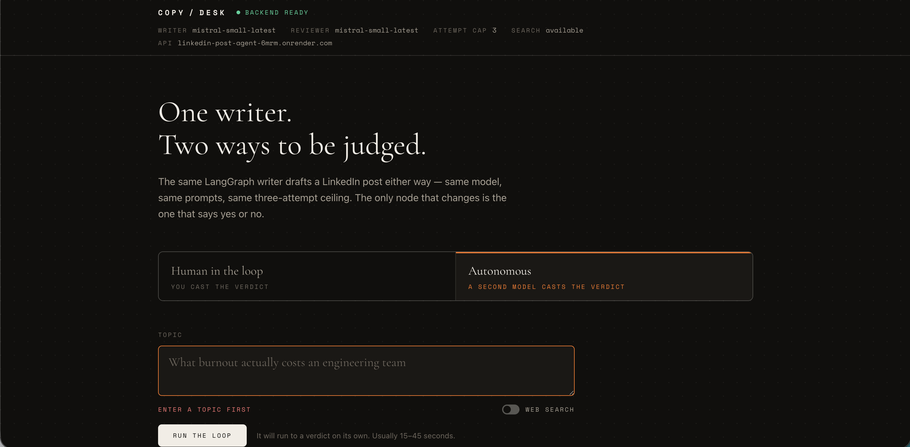
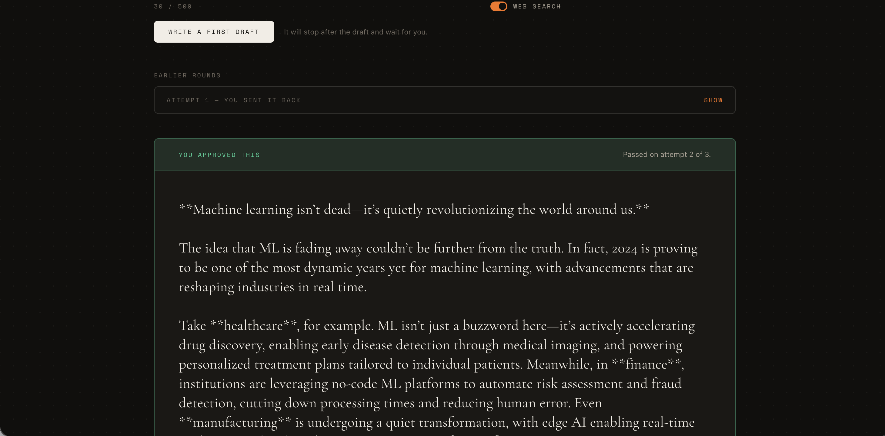
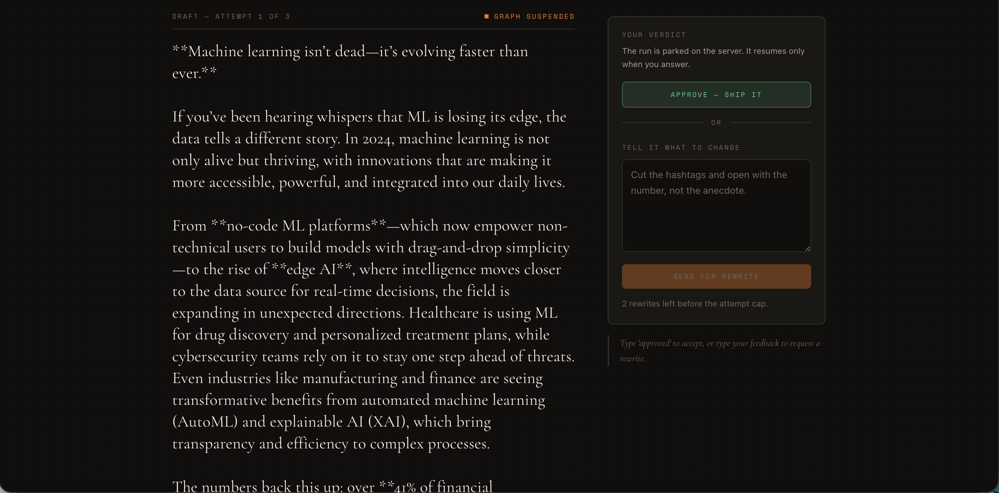
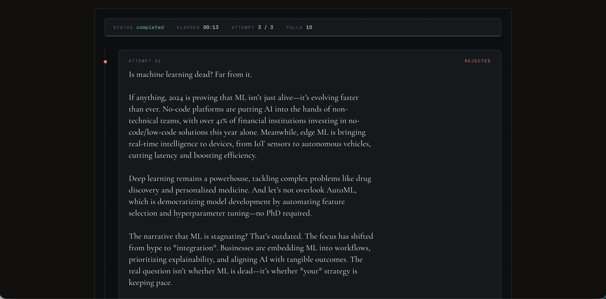

# LinkedIn Post Agent

[](https://python.org/)
[](https://fastapi.tiangolo.com/)
[](https://react.dev/)
[](https://vitejs.dev/)
[](https://langchain-ai.github.io/langgraph/)
[](https://mistral.ai/)
[](https://tavily.com/)
[](https://linkedin-post-agent-two.vercel.app/)
[](https://linkedin-post-agent-6mrm.onrender.com)
[](https://linkedin-post-agent-two.vercel.app/)




A LangGraph-based intelligent agent that generates LinkedIn posts using two distinct execution models: a Human-in-the-Loop (HITL) workflow that pauses for explicit approval, and an autonomous loop that relies on an LLM-driven reviewer to iterate independently. By sharing the exact same writer chain, this project isolates the review mechanism to clearly demonstrate how human gating changes application architecture, state management, and deployment constraints.

## Demo

**Live Frontend:** [https://linkedin-post-agent-two.vercel.app/](https://linkedin-post-agent-two.vercel.app/)

*(Note: The backend may spin down after inactivity on the Render free tier, meaning the first request could take up to 30-60 seconds to wake up.)*

This project demonstrates two distinct generation flows:
- **Human-in-the-Loop (HITL):** Generates a draft, suspends execution, and waits for a human to approve or provide feedback.
- **Autonomous Generation:** Generates a draft, self-evaluates using a separate LLM reviewer node, and iteratively refines the post until it meets quality standards (up to a configured attempt limit).


## Why This Project?

Building reliable LLM applications often comes down to the tradeoff between autonomy and control. This project tackles the engineering problem of generating LinkedIn content by presenting two identical pipelines that diverge only at the review step.

Comparing human approval with autonomous execution reveals how "agentic" workflows behave differently under supervision. More importantly, it demonstrates how adding a human to the loop drastically changes the backend requirements: an autonomous process runs start-to-finish in a single HTTP request, whereas a human-gated process requires the graph state to be suspended, persisted, and accurately resumed later.

## Features

- **Human-in-the-Loop Workflow:** Pauses LangGraph execution using `interrupt()`, awaiting explicit human approval or revision instructions before proceeding.
- **Autonomous Workflow:** Utilizes a structured-output LLM reviewer to automatically grade drafts, passing feedback back to the writer for autonomous iteration.
- **Shared Core Logic:** Both workflows import the exact same LangChain generation sequence, ensuring accurate side-by-side comparison.
- **Web Search Augmentation:** Integrates the Tavily search tool (optional) to pull in current data when generating posts.
- **State Management:** Utilizes LangGraph's `MemorySaver` to checkpoint and resume in-process graph state.
- **React/Vite Frontend:** A dedicated client for testing both the interactive HITL flow and the polling-based autonomous background job.

## Human-in-the-Loop vs Autonomous

This project isolates the review mechanism to show how the architecture changes when a human is involved.

**Human-in-the-Loop (HITL)**
`User → Writer Node → Extracted Draft → Graph Suspends (interrupt) → Human Review (approve/reject) → Graph Resumes → Final Output`

Because the human review step takes time, the graph must pause. This requires a checkpointer (`MemorySaver` here) and a thread identity so the process can be put down and picked back up later. This single requirement dictates that subsequent requests must land on the same instance that holds the state in memory.

**Autonomous**
`User → Writer Node → Extracted Draft → LLM Reviewer Node (approve/reject) → Loop back to Writer → Final Output`

The autonomous loop requires neither suspension nor a checkpointer. It runs from start to finish in one background execution. The challenge here is ensuring the LLM reviewer's verdict is parsed reliably and that it knows when to stop iterating (e.g., maximum attempts).

## Architecture


- **Frontend:** React + Vite + Tailwind UI
- **API Layer:** FastAPI exposing HTTP routes for starting and resuming graphs
- **Agent Orchestration:** LangGraph handling state graphs, conditional edges, and interrupts
- **LLM Engine:** Mistral AI via LangChain for drafting and reviewing
- **Tooling:** Tavily Search for real-time web context

## Tech Stack

| Category | Technology |
|---|---|
| **Frontend** | React (19), Vite (8), Tailwind CSS (4), TypeScript |
| **Backend** | Python 3.13, FastAPI, Uvicorn |
| **Agent Orchestration** | LangGraph, LangChain Core |
| **AI/LLM** | Mistral AI (`langchain-mistralai`) |
| **Search/Tools** | Tavily (`langchain-tavily`) |
| **Deployment** | Vercel (Frontend), Render (Backend) |

## Project Structure

- `app/`
  - `api.py`: FastAPI routes handling the HITL and Auto endpoints.
  - `config.py`: Environment checks, model configurations, and logging setup.
  - `state.py`: The `PostState` schema shared by both graphs.
  - `writer.py`: The shared LangGraph chain (prepare, write, search, extract).
  - `reviewer.py`: The structured-output LLM reviewer for the autonomous graph.
  - `graph_hitl.py`: The HITL graph utilizing the `interrupt()` node and `MemorySaver`.
  - `graph_auto.py`: The autonomous graph utilizing the LLM reviewer node.
  - `jobs.py`: In-memory thread and job trackers.
- `cli_hitl.py` & `cli_auto.py`: Terminal-based runners for debugging without the API.
- `frontend/`: The React + Vite client application.


### Generated LinkedIn Post


## How It Works

### 1. Human-in-the-Loop Flow


1. The frontend calls `POST /api/hitl/start` with a topic.
2. The `app_hitl` graph executes the shared writer chain.
3. Upon extracting the draft, the graph hits the `human_review` node, calls `interrupt()`, and pauses.
4. The API returns the draft to the frontend with an `awaiting_review` status.
5. The human reviews the draft and submits feedback via `POST /api/hitl/resume`.
6. The graph resumes. If approved, it routes to `END`. If rejected, it routes back to `prepare_attempt` with the feedback appended to the state.

### 2. Autonomous Flow


1. The frontend calls `POST /api/auto/start` with a topic, receiving an immediate HTTP 202 response and a `job_id`.
2. The `app_auto` graph begins executing in a background thread.
3. After the writer extracts a draft, it passes to the `reviewer` node, which prompts an LLM to evaluate the post.
4. The reviewer outputs a structured decision (approve/reject + critique).
5. The graph loops automatically until approved or the `MAX_ATTEMPTS` limit is reached.
6. The frontend polls `GET /api/auto/status/{job_id}` to stream the history of rejected drafts and the final output.

## Local Development

### Backend Setup

1. Clone the repository and configure the virtual environment:
   ```bash
   uv venv
   VIRTUAL_ENV=.venv uv pip install -r requirements.txt
   ```
2. Create a `.env` file in the root directory (see Environment Variables).
3. Start the FastAPI server:
   ```bash
   .venv/bin/python -m uvicorn app.api:app --reload
   ```

### Frontend Setup

1. Navigate to the frontend directory:
   ```bash
   cd frontend
   ```
2. Install dependencies:
   ```bash
   npm install
   ```
3. Start the Vite development server:
   ```bash
   npm run build && npm run preview
   ```
   *(Alternatively, run `npm run preview` with background execution during development)*

## Environment Variables

| Variable | Used By | Purpose |
|---|---|---|
| `MISTRAL_API_KEY` | Backend | Required. Authenticates calls to the Mistral AI API for both writing and reviewing. |
| `TAVILY_API_KEY` | Backend | Optional. Enables web search augmentation if present. |
| `LOG_LEVEL` | Backend | Optional. Sets Python logging level (e.g., INFO, DEBUG). |
| `MAX_ATTEMPTS` | Backend | Optional. Maximum revision rounds before the graph forces an end (default: 3). |
| `CORS_ORIGINS` | Backend | Optional. Allows specific frontend URLs to access the API. |
| `VITE_API_BASE` | Frontend | Optional. Defines the base URL the frontend uses to contact the backend (e.g., `http://localhost:8000`). |

*Note: Secrets must never be committed to Git. The backend checks for key presence without logging values.*

## API Documentation

### Human-in-the-Loop
- `POST /api/hitl/start`: Starts the flow. Accepts `{ "topic": "...", "enable_search": false }`. Returns the first draft, `thread_id`, and status `awaiting_review`.
- `POST /api/hitl/resume`: Submits feedback. Accepts `{ "thread_id": "...", "feedback": "approved | critique" }`. Returns either another draft (`awaiting_review`) or the final output (`completed`).

### Autonomous
- `POST /api/auto/start`: Initiates the background loop. Accepts `{ "topic": "...", "enable_search": false }`. Returns `202 Accepted` and a `job_id`.
- `GET /api/auto/status/{job_id}`: Polls for status. Returns job state (`running`, `completed`, or `error`), current attempt count, history of failed drafts, and the final draft.

### Health
- `GET /api/health`: Returns API key presence and current LLM model configuration.

## Deployment

**Frontend:** Deployed via Vercel at [https://linkedin-post-agent-two.vercel.app/](https://linkedin-post-agent-two.vercel.app/). It uses the `VITE_API_BASE` environment variable to point to the production backend.

**Backend:** Deployed via Render. It uses `CORS_ORIGINS` to allow requests explicitly from the Vercel frontend.

**Important Deployment Note:** The backend currently runs on Render's Free tier, which spins down after 15 minutes of inactivity.
- The first request after a sleep period may take longer (cold start).
- **Crucially:** Because the HITL flow relies on `MemorySaver` (an in-process Python dictionary), if the backend spins down while a draft is awaiting human review, the session state is lost, resulting in a 404 on the next resume request.

## Important Architecture / Design Decisions

- **Why LangGraph:** LangGraph provides native support for cyclical workflows (loops) and explicit interruptions. This makes it trivial to represent an iterative writing process that routes back on itself.
- **Shared Writer Logic:** By sharing the exact same `app/writer.py` pipeline, the comparison between HITL and Autonomous is isolated entirely to the review node, preventing prompt drift between the two modes.
- **In-Memory Checkpointing:** The project deliberately uses `MemorySaver` for state. While this means state is wiped on server restarts, it perfectly illustrates the architectural cost of human suspension: a real production deployment would require a persistent checkpointer (like Postgres or SQLite) to safely survive multi-instance scaling and cold starts.
- **Structured Output parsing:** The autonomous reviewer attempts to use Pydantic structured output. If unsupported, it fails closed to an anchored regex check, ensuring format drift results in a safe rejection rather than an unverified approval.

## Security and Limitations

- **No Authentication / Rate Limiting:** The API is unauthenticated and unprotected by rate limits. Anyone with the URL can trigger LLM generation. This is a deliberate tradeoff for a portfolio demo.
- **In-Memory Sessions:** As noted, scaling the backend beyond one instance or deploying on a scale-to-zero serverless platform (like Render Free) will result in lost HITL sessions because `MemorySaver` state cannot be shared across processes.
- **Error Handling Check:** The architecture explicitly checks for LLM failure states before suspension. If an API call fails, the graph routes straight to `END` and returns a 502 rather than asking a human to review a system error.

## Future Improvements

- **Persistent Checkpoint Storage:** Replace `MemorySaver` with `PostgresSaver` or `SqliteSaver` to ensure HITL sessions survive process restarts and allow horizontal scaling.
- **Authentication & Rate Limiting:** Add basic API key validation or user sessions to protect LLM credits.
- **Production-Grade Deployment:** Upgrade backend hosting to an always-on tier to prevent cold starts and session eviction.
- **Evaluation Framework:** Introduce an evaluation metric (e.g., LangSmith) to score generated posts against successful real-world LinkedIn content.
