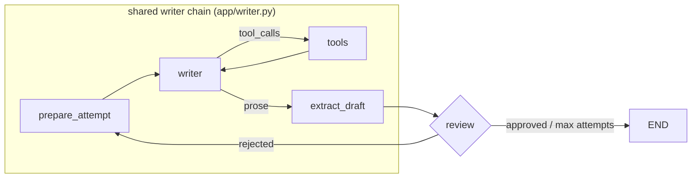

# LinkedIn Post Generator — Human-in-the-Loop vs Autonomous

Two LangGraph agents that write LinkedIn posts. One stops and waits for a human to approve every draft. The other reviews its own work with a second LLM and iterates until it passes. A frontend toggle picks which one runs.

The point isn't the posts. It's that the two pipelines are **identical except for the review mechanism**, so the comparison actually isolates the thing being compared.

```console
$ diff <(grep -o 'add_node("[a-z_]*"' app/graph_hitl.py) <(grep -o 'add_node("[a-z_]*"' app/graph_auto.py)
< add_node("human_review"
> add_node("reviewer"
```

Same writer model, same temperature, same prompts, same search tool, same retry logic, same stopping conditions — all imported from one shared module. One node differs. That's the demo.

## The two graphs



`review` is the only swappable part:

| | Human-in-the-loop | Autonomous |
|---|---|---|
| Review node | `interrupt()` — graph suspends | LLM reviewer with structured output |
| Checkpointer | `MemorySaver` (required — state must survive the pause) | none (nothing pauses) |
| Latency | as long as the human takes | ~15–45s for up to 3 rounds |
| API shape | start → resume → resume … | start → poll → poll … |
| Fails toward | whatever the human says | rejection, on unparseable verdicts |

### Why that difference matters

The human-gated loop needs a **checkpointer** and a **thread identity**, because the process has to put the graph down and pick it back up later. That single requirement is what drags in every hosting constraint in [DEPLOYMENT.md](DEPLOYMENT.md) — an in-memory checkpointer means the resume request must reach the same process that served the start request.

The autonomous loop needs neither. It runs start to finish in one call. It just has to be right without supervision, which is a different problem: the reviewer's verdict has to be parsed reliably, and it has to know when to give up.

## Layout

```
app/
  config.py      env checks, model IDs, limits, logging
  state.py       PostState — the schema both graphs share
  prompts.py     writer + reviewer system prompts
  llm.py         model factories, invoke_with_retry(), LLMError
  tools.py       Tavily search; degrades to [] with no key
  writer.py      the shared chain + loop router      <- both graphs import this
  reviewer.py    structured-output verdict + fallback parser
  graph_hitl.py  shared chain + interrupt() node
  graph_auto.py  shared chain + LLM reviewer node
  jobs.py        in-process job/session stores
  runner.py      streams the auto graph into the job store
  api.py         FastAPI routes
cli_hitl.py      terminal version of the HITL loop
cli_auto.py      terminal version of the autonomous loop
frontend/        Vite + React client for both modes — see frontend/README.md
```

## Setup

Needs Python 3.13 and a Mistral API key. Tavily is optional — without it, search is disabled and the writer runs unaugmented.

```bash
uv venv
VIRTUAL_ENV=.venv uv pip install -r requirements.txt
```

Create a `.env`:

```
MISTRAL_API_KEY=...
TAVILY_API_KEY=...        # optional
LOG_LEVEL=INFO            # optional; DEBUG logs full drafts
MAX_ATTEMPTS=3            # optional
CORS_ORIGINS=http://localhost:5173
```

Confirm it loaded — this reports key *presence*, never values:

```bash
curl localhost:8000/api/health
```

## Run

```bash
# API
.venv/bin/python -m uvicorn app.api:app --reload

# or the terminal versions
.venv/bin/python cli_hitl.py
.venv/bin/python cli_auto.py
```

The browser client lives in [`frontend/`](frontend) and expects the API on port 8000:

```bash
cd frontend && npm install && npm run dev   # http://localhost:5173
```

## API

`thread_id` and `job_id` are always generated server-side. Clients echo back what they were given.

### Human-in-the-loop

```jsonc
POST /api/hitl/start     { "topic": "...", "enable_search": false }
-> { "thread_id": "hex", "status": "awaiting_review", "draft": "...",
     "attempt": 1, "instruction": "Type 'approved' to accept, or ..." }

POST /api/hitl/resume    { "thread_id": "...", "feedback": "approved | critique" }
-> { "status": "awaiting_review", "draft": "...", "attempt": 2, ... }   // another round
-> { "status": "completed", "draft": "...", "attempt": 2,
     "is_approved": true, "stop_reason": "approved" }                   // or "max_attempts"
```

Loop while `status` is `awaiting_review`; render the post on `completed`.

### Autonomous

```jsonc
POST /api/auto/start     { "topic": "...", "enable_search": false }     -> 202
-> { "job_id": "hex", "status": "running" }

GET  /api/auto/status/{job_id}      // poll ~1.5s
-> { "status": "running|completed|error", "attempt": 2,
     "history": [ { "attempt": 1, "draft": "...", "approved": false, "feedback": "..." } ],
     "draft": "...", "is_approved": true, "stop_reason": "approved", "error": null }
```

`history` grows as the loop iterates, so the UI can show each rejected draft alongside the critique that killed it.

### Errors

| Code | Meaning |
|---|---|
| `400` | blank topic |
| `404` | unknown or expired `thread_id` / `job_id` |
| `502` | LLM call failed after retries — `{"detail": "..."}` |

An expired `thread_id` is a real scenario, not just a bad request: sessions live in process memory, so a restart drops them.

## Design notes

**One shared writer, not two matching prompts.** Both graphs call `add_writer_chain()`. Two copies of an "identical" prompt drift the first time someone edits one; a shared import can't.

**Tool results route back to the writer, not forward.** `tools → writer`, so the model can actually use what it searched for. Routing search results forward to the review step instead means the reviewer grades an empty draft and the search is decorative — which is exactly what the earlier version of this code did.

**Verdict parsing is structured-first, and fails closed.** The reviewer uses `.with_structured_output()` with a Pydantic model. If a provider doesn't support it, it falls back to a regex anchored on `VERDICT:` — anchoring matters, because an unanchored substring test reads `VERDICT: REJECTED (this is not approved yet)` as an approval. If nothing parses, the draft is treated as **rejected**: format drift then costs one extra revision, bounded by `MAX_ATTEMPTS`, instead of shipping a post nothing ever graded.

**Errors end the graph before review.** A failed LLM call sets `state["error"]` and routes straight to `END`. Without that, `extract_draft` reads the last message — still the unanswered instruction prompt — and hands it to the review node as if it were a draft. The result reads like a plausible post and returns `200`. Recording an error isn't enough; something has to check it before the graph pauses.

**Search is capped at `MAX_TOOL_ROUNDS = 2`** per attempt, so a model that keeps deciding to search can't stall a live demo.

## Scope

This is a portfolio demo, not a service. Deliberate consequences:

- **In-process state.** `MemorySaver` and the job store are plain dicts. Must run as a single worker; a restart drops in-flight sessions. See [DEPLOYMENT.md](DEPLOYMENT.md) for what that constrains — the fix is a SQLite or Postgres checkpointer, intentionally not done here.
- **No auth, no rate limiting.** Anything with the URL can spend your API credits.
- **No tests committed.** Verification was run ad hoc against the live API; the results are recorded in [PLAN.md](PLAN.md). First thing to add if this grows.

## Docs

- [PLAN.md](PLAN.md) — the audit of the original scripts, the design, and what was verified
- [DEPLOYMENT.md](DEPLOYMENT.md) — hosting comparison and the `interrupt()`/checkpointer constraint
